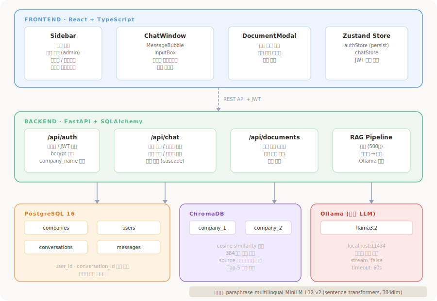

# Company Assistant

RAG(Retrieval-Augmented Generation) 기반 사내 AI 챗봇. 회사별로 문서를 업로드하면 직원들이 해당 문서를 기반으로 AI와 대화할 수 있습니다.

---

## 시스템 아키텍처



---

## 기술 스택

| 영역 | 기술 |
|------|------|
| 프론트엔드 | React 19, TypeScript, Vite 8 |
| 상태 관리 | Zustand |
| HTTP 클라이언트 | Axios |
| 라우팅 | React Router v6 |
| 백엔드 | FastAPI, SQLAlchemy (async) |
| DB | PostgreSQL 16 |
| 벡터 DB | ChromaDB |
| 임베딩 모델 | sentence-transformers (paraphrase-multilingual-MiniLM-L12-v2) |
| LLM | Ollama (gemma3:4b, 로컬) |
| 인증 | JWT (python-jose) |
| 인프라 | Docker Compose |

---

## 프로젝트 구조

```
company-assistant/
├── frontend/
│   └── src/
│       ├── components/
│       │   ├── Chat/
│       │   │   ├── Sidebar.tsx        # 대화목록, 문서관리, 프로필
│       │   │   ├── ChatWindow.tsx     # 메시지 목록
│       │   │   ├── MessageBubble.tsx  # 메시지 말풍선
│       │   │   ├── InputBox.tsx       # 메시지 입력창
│       │   │   └── DocumentModal.tsx  # 문서 관리 모달
│       │   └── Layout/
│       │       └── ProtectedRoute.tsx
│       ├── pages/
│       │   ├── LoginPage.tsx
│       │   └── ChatPage.tsx
│       ├── store/
│       │   ├── authStore.ts           # 인증 상태 (persist)
│       │   └── chatStore.ts           # 채팅 상태
│       ├── services/
│       │   └── api.ts                 # authApi / chatApi / documentApi
│       └── types/
│           └── index.ts
│
└── backend/
    ├── app/
    │   ├── api/
    │   │   ├── auth.py                # POST /api/auth/login
    │   │   ├── chat.py                # POST /api/chat, GET /api/chat/conversations
    │   │   └── documents.py           # POST/GET/DELETE /api/documents
    │   ├── core/
    │   │   ├── config.py
    │   │   ├── database.py
    │   │   └── security.py            # JWT, bcrypt
    │   ├── models/
    │   │   ├── db_models.py           # Company, User, Conversation, Message
    │   │   └── schemas.py
    │   ├── rag/
    │   │   ├── chunker.py             # 텍스트 추출 및 청킹
    │   │   ├── embedder.py            # sentence-transformers
    │   │   ├── retriever.py           # ChromaDB 검색/저장/삭제
    │   │   ├── generator.py           # Ollama LLM 호출
    │   │   └── pipeline.py            # RAG 전체 파이프라인
    │   ├── services/
    │   │   └── document_service.py
    │   └── main.py
    ├── seed.py                        # 초기 데이터 시딩
    ├── requirements.txt
    └── .env
```

---

## 시작하기

### 사전 요구사항

- Docker Desktop
- Python 3.12
- Node.js 20+
- Ollama

### 1. 인프라 실행

```bash
docker-compose up -d
```

PostgreSQL (5432), ChromaDB (8001) 실행

### 2. Ollama 모델 준비

```bash
brew install ollama
brew services start ollama
ollama pull gemma3:4b
```

### 3. 백엔드

```bash
cd backend
python -m venv venv
source venv/bin/activate
pip install -r requirements.txt

# DB 초기화 및 시딩
python seed.py

# 서버 실행
uvicorn app.main:app --reload
```

### 4. 프론트엔드

```bash
cd frontend
npm install
npm run dev
```

브라우저에서 http://localhost:5173 접속

---

## 구현 현황

### 백엔드
- [x] JWT 인증 (로그인 / 토큰 발급)
- [x] 회사별 다중 테넌트 구조 (Company / User)
- [x] 역할 기반 접근 제어 (admin / employee)
- [x] 문서 업로드 API (PDF / DOCX / TXT)
- [x] RAG 파이프라인 (청킹 → 임베딩 → 검색 → 생성)
- [x] PDF 표 추출 개선 (헤더 포함 구조화 텍스트 변환)
- [x] 채팅 API (대화 생성 / 메시지 저장)
- [x] 대화 목록 / 메시지 조회 API
- [x] 대화 삭제 API
- [x] 문서 목록 / 삭제 API
- [x] LLM 모델 최적화 (llama3.2 → gemma3:4b, 한국어 품질 개선)
- [x] 프롬프트 강화 (할루시네이션 방지 / 언어 혼용 방지 / 톤 설정)

### 프론트엔드
- [x] 로그인 화면
- [x] Protected Route
- [x] 사이드바 (대화 목록 / 새 대화 / 대화 삭제)
- [x] 채팅 UI (말풍선 / 자동 스크롤 / 타이핑 애니메이션)
- [x] 실제 백엔드 API 연결
- [x] 관리자 전용 문서 관리 모달 (업로드 / 삭제)
- [x] 회사 이름 표시 ({회사명} 어시스턴트)
- [x] 로그아웃 시 채팅 상태 초기화
- [x] 대화별 로딩 상태 관리 (대화 전환 중 말풍선 / 메시지 보존)
